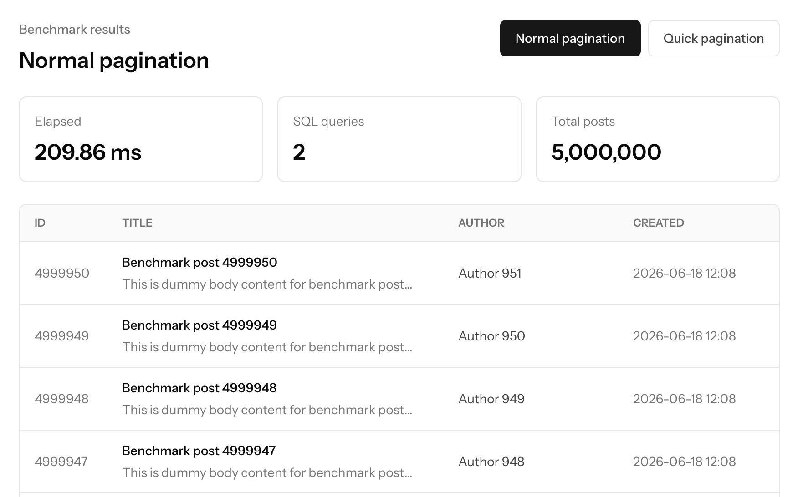
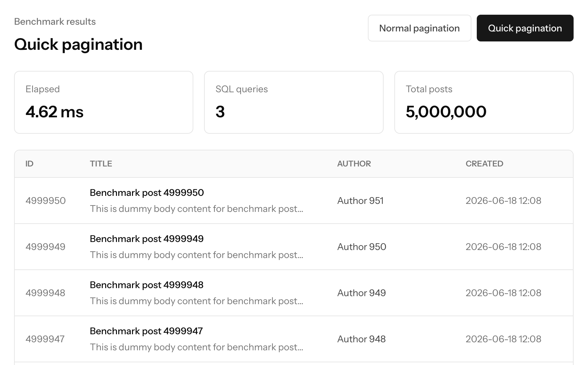

# Laravel Quick Paginator
[](https://packagist.org/packages/askdkc/laravel-quick-paginator)
[](https://github.com/askdkc/laravel-quick-paginator/actions?query=workflow%3Atest+branch%3Amain)
[](https://packagist.org/packages/askdkc/laravel-quick-paginator)
[](https://github.com/sponsors/askdkc)


Laravel Quick Paginator speeds up both halves of length-aware pagination:

- **Count** — it caches the `total` value, so on later page requests the repeated pagination `count(*)` query is skipped.
- **Row fetch** — it uses the [fast-paginate](https://github.com/aarondfrancis/fast-paginate) deferred-join technique: an index-only inner query finds just the current page's primary keys, then the full rows are loaded for only those keys. This avoids the expensive `select * ... offset N` on deep pages.

It does not cache result rows, replace paginator classes, or change the normal `LengthAwarePaginator` response shape. Queries with `GROUP BY`, `HAVING`, or `DISTINCT` automatically fall back to Laravel's native row fetch (while still using the cached total).

### 日本語

Laravel Quick Paginator は、LengthAware Pagination の両方の処理を高速化します。

- **count** — `total` 値をキャッシュするため、以降のページリクエストでは繰り返しの `count(*)` クエリを実行しません。
- **行取得** — [fast-paginate](https://github.com/aarondfrancis/fast-paginate) の deferred-join 手法を使います。index だけの内側クエリで現在のページの主キーを取得し、その主キーに対してだけ行全体を読み込みます。これにより、深いページでの重い `select * ... offset N` を回避します。

このパッケージは、結果行をキャッシュしません。paginator クラスを置き換えることもありません。通常の LengthAwarePaginator のレスポンス形式も変更しません。`GROUP BY`・`HAVING`・`DISTINCT` を含むクエリは、自動的に Laravel 標準の行取得にフォールバックします（その場合もキャッシュ済み total は利用します）。

## Benchmark

In this benchmark, both examples paginate a table with 5,000,000 posts.

Normal Laravel pagination finished in **795.90 ms**:



Quick pagination finished in **264.69 ms**:



That is roughly **3x faster** in this run. The gain comes from reusing the cached total count instead of repeating Laravel's expensive pagination count query on every page request. Query count alone may not always be lower because cache operations or application queries can still be recorded, but the costly `count(*)` work is avoided on cache hits.

### Local benchmark test

The test suite includes an opt-in benchmark that seeds **1,000,000** dummy users
and compares native Laravel `paginate()` with `quickPaginate()` on a deep page.
It is skipped during the normal `composer test` run so CI and everyday test runs
stay fast.

Run it explicitly with:

```bash
RUN_QUICK_PAGINATE_BENCHMARK=1 ./vendor/bin/pest --group=benchmark
```

The benchmark warms the quick pagination total cache first, then prints elapsed
time, query count, and count-query count for both paginators. It also asserts
that both paginators return the same total and item IDs, and that
`quickPaginate()` does not run a `count(*)` query on the measured cache-hit run.

### 日本語

このベンチマークでは、5,000,000 件の posts テーブルに対して pagination を実行しています。

通常の Laravel pagination は **795.90 ms** でした。


Quick pagination は **264.69 ms** でした。


この実行では、およそ **3 倍高速** になっています。高速化の理由は、ページ移動のたびに重い pagination 用の `count(*)` クエリを繰り返さず、キャッシュ済みの total 件数を再利用するためです。キャッシュ処理やアプリケーション側のクエリが記録されることがあるため、SQL query 数だけが常に少なくなるとは限りませんが、cache hit 時には高コストな `count(*)` を避けられます。

### ローカルベンチマークテスト

テストスイートには、**1,000,000 件**のダミー user を作成し、深いページで Laravel 標準の `paginate()` と `quickPaginate()` を比較する opt-in のベンチマークテストが含まれています。通常の `composer test` では skip されるため、CI や普段のテスト実行は重くなりません。

明示的に実行する場合は、次のコマンドを使います。

```bash
RUN_QUICK_PAGINATE_BENCHMARK=1 ./vendor/bin/pest --group=benchmark
```

このベンチマークは、先に quick pagination の total cache を warm up してから、両方の paginator について実行時間、query 数、count query 数を出力します。また、両方の total と item ID が一致すること、計測対象の cache hit 実行で `quickPaginate()` が `count(*)` を実行しないことも検証します。

## Installation

```bash
composer require askdkc/laravel-quick-paginator
```

Publish the config when you need to change the cache store, prefix, or TTL:

```bash
php artisan vendor:publish --tag=cached-pagination-config
```

### 日本語

インストールします。

```bash
composer require askdkc/laravel-quick-paginator
```

キャッシュストア、プレフィックス、TTL を変更したい場合は、設定ファイルを公開してください。

```bash
php artisan vendor:publish --tag=cached-pagination-config
```

## Usage

Use `quickPaginate()` where you would normally use `paginate()`.

```php
$users = User::query()
    ->where('active', true)
    ->quickPaginate(50);
```

Query builder usage is supported too:

```php
$users = DB::table('users')
    ->where('active', true)
    ->quickPaginate(50);
```

The method signature stays close to Laravel's paginator:

```php
quickPaginate(
    $perPage = null,
    $columns = ['*'],
    $pageName = 'page',
    $page = null,
    ?int $ttl = null,
    bool $fresh = false,
    ?string $cacheKey = null,
    ?string $primaryKey = null,
)
```

The deferred join needs a primary key. For Eloquent it is read from the model.
For the query builder it defaults to `id`; pass `primaryKey:` if your table uses
a different key:

```php
$rows = DB::table('users')
    ->where('active', true)
    ->quickPaginate(50, primaryKey: 'uuid');
```

### 日本語

通常の `paginate()` を使う箇所で、代わりに `quickPaginate()` を使用します。

```php
$users = User::query()
    ->where('active', true)
    ->quickPaginate(50);
```

Query Builder でも利用できます。

```php
$users = DB::table('users')
    ->where('active', true)
    ->quickPaginate(50);
```

メソッドシグネチャは Laravel 標準の paginator に近い形になっています。

```php
quickPaginate(
    $perPage = null,
    $columns = ['*'],
    $pageName = 'page',
    $page = null,
    ?int $ttl = null,
    bool $fresh = false,
    ?string $cacheKey = null,
    ?string $primaryKey = null,
)
```

追加パラメータとして、`$ttl`、`$fresh`、`$cacheKey`、`$primaryKey` を指定できます。

- `$ttl` は、この pagination total 用のキャッシュ TTL を個別に指定します。
- `$fresh` に `true` を指定すると、キャッシュ済み total を使わずに再度 `count(*)` を実行し、キャッシュを更新します。
- `$cacheKey` を指定すると、独自のキャッシュキーで total 件数を保存できます。
- `$primaryKey` は deferred join で使う主キー列です。Eloquent では model から取得します。Query Builder では既定値が `id` のため、別の主キーを使うテーブルでは指定してください。

```php
$rows = DB::table('users')
    ->where('active', true)
    ->quickPaginate(50, primaryKey: 'uuid');
```

## Demo App

If you want to test this package in a real Laravel application, use the demo app here:

https://github.com/askdkc/laravel-quick-pagination-demo

### 日本語

実際の Laravel アプリケーションで試したい場合は、こちらのデモアプリを使ってください。

https://github.com/askdkc/laravel-quick-pagination-demo

## Configuration

Default config:

```php
return [
    'enabled' => true,
    'store' => null,
    'prefix' => 'cached-pagination-total',
    'ttl' => 300,
];
```

The default TTL is intentionally short because the package trades total freshness for fewer count queries. Set `store` to use a non-default Laravel cache store.

### 日本語

デフォルト設定は以下の通りです。

```php
return [
    'enabled' => true,
    'store' => null,
    'prefix' => 'cached-pagination-total',
    'ttl' => 300,
];
```

デフォルト TTL は意図的に短めに設定されています。このパッケージは total 件数の厳密な最新性と、pagination 時の `count(*)` クエリ削減をトレードオフするためです。

`store` を指定すると、Laravel のデフォルトキャッシュストア以外を利用できます。

## Refreshing Totals

Pass `fresh: true` to bypass the cached total, run the count once, and replace the cache entry:

```php
$users = User::query()->quickPaginate(50, fresh: true);
```

You may also provide a custom cache key:

```php
$users = User::query()
    ->where('active', true)
    ->quickPaginate(50, cacheKey: 'users.active.total');
```

### 日本語

`fresh: true` を指定すると、キャッシュ済み total を無視し、一度だけ `count(*)` を実行してキャッシュを更新します。

```php
$users = User::query()->quickPaginate(50, fresh: true);
```

独自のキャッシュキーを指定することもできます。

```php
$users = User::query()
    ->where('active', true)
    ->quickPaginate(50, cacheKey: 'users.active.total');
```

## Notes

Laravel Quick Paginator supports `Model::query()->quickPaginate()` and `DB::table(...)->quickPaginate()` in v1.

Relation-specific paginator methods are intentionally not promised yet because some relation classes do not expose Laravel's fifth `paginate()` `$total` argument directly. Cursor pagination and simple pagination are also out of scope because they do not use total counts in the same way.

### 日本語

v1 では、`Model::query()->quickPaginate()` と `DB::table(...)->quickPaginate()` をサポートしています。

Relation ごとの paginator メソッドについては、現時点ではサポートを保証していません。一部の Relation クラスでは、Laravel の `paginate()` が持つ第 5 引数 `$total` を直接公開していないためです。

Cursor Pagination と Simple Pagination も対象外です。これらは LengthAware Pagination と違い、同じ形で total 件数を利用しないためです。

## Development

Install dependencies:

```bash
composer install
```

Run the Pest test suite:

```bash
composer test
```

Run Larastan static analysis:

```bash
composer analyse
```

### 日本語

依存パッケージをインストールします。

```bash
composer install
```

Pest テストを実行します。

```bash
composer test
```

Larastan による静的解析を実行します。

```bash
composer analyse
```
